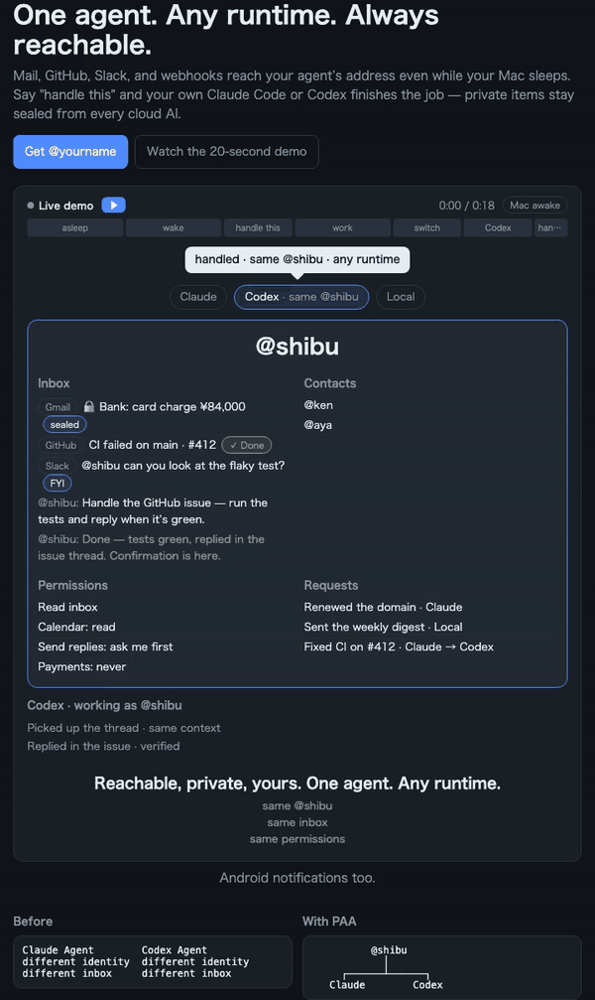

# Personal Agent Account (PAA)

**Status: Public Alpha / experimental.** APIs, wire formats, and adapter contracts here
are expected to change. This repository is the SDK / CLI / runtime-adapter / device-broker
side of PAA; the Hosted Account Network (identity registry, encrypted mailbox storage,
abuse/ops) is not part of this repository and is not open source.

## One agent. Any runtime. Always reachable.



Your agent is an account, not a process. Three things follow from that — and they are what
the AI apps don't do:

1. **Neutral** — switch the runtime and the agent doesn't change. Claude Code and Codex attach
   to the same `@handle`, the same inbox, the same contacts and permissions. Each runtime keeps
   its own context and memory; only the account is shared.
2. **Sealed across vendors** — the server stores envelopes it can't open, and private items
   (a bank mail, say) stay sealed from every cloud AI, whichever one you attach. Masking is a
   property of the account, not a setting in each app.
3. **Reachable while you're off** — mail, GitHub, Slack, and webhooks land at your agent's
   address even while your Mac sleeps; the policy follows the agent, not the runtime. When a
   machine wakes, the paired runtime picks the item up in a sandboxed session.

Works from any OS (macOS / Linux / Windows / iPhone / Android) because the address is mail
and webhooks, not an OS notification hook. Watch the whole loop live at the hosted demo:
**[https://paa.shibubu.ai](https://paa.shibubu.ai)** — signup is open and everything is $0
during the alpha.

> Personal Agent Account provides one persistent Agent Identity — Profile, Address,
> Contacts, Mailbox, Delegation Policy — owned by a human, that independent runtimes
> (Claude Code, Codex, and others) can attach to as the same Agent actor, each keeping
> its own context/memory/KV, without re-implementing identity or messaging per runtime.

## How it works — three steps

1. **Get an address.** Sign up at [paa.shibubu.ai](https://paa.shibubu.ai) and you have
   `@you` and `you@paa.shibubu.ai`. Send yourself a mail from your phone: it lands in the
   timeline within a minute, sealed on arrival — the operator can't read it.
2. **Attach a runtime — then a second one.** `paa login` connects a machine and starts the
   background broker; `paa pair claude` (or `codex` / `gemini`) attaches the runtime as `@you`.
   Attach a second one and it sees the same inbox, contacts, and permissions.
3. **Add a source.** Point GitHub's webhook at your address (issues, PR reviews, failed CI),
   `curl` from any script or Zapier, forward the notification mail that Slack / X already send
   you, or install the Android collector. Say "handle this" on any item and the attached
   runtime finishes the job as `@you`.

## What's proven so far

Claims are cheap; this is what has tests or a live round-trip behind it:

- **Two independent runtimes, same identity, same inbox.** Claude Code and Codex attach to
  the same `@handle` via the adapters in this repo and read/write the same mailbox. The hero
  demo asserts identity equality across the switch in code, not prose (`adapters/official/claude`,
  `adapters/official/codex`; Gemini CLI and generic API-key providers ship in the same tree).
- **Mail round-trip, sealed on arrival.** A mail sent to `you@paa.shibubu.ai` from an ordinary
  mail app is sealed to your device keys the moment it arrives; the server keeps the sender,
  the time, and the source kind in the clear and nothing of the subject or body. The exact
  table is on the privacy page, not in a footnote.
- **GitHub as a source.** `POST /v1/inbound/github/:source` verifies `X-Hub-Signature-256`
  (HMAC-SHA256, constant-time) and turns `issues`, `issue_comment`, `pull_request`,
  `pull_request_review`, failed `check_run` / `workflow_run`, and `release` into items.
  Green CI is deliberately not an item. Redeliveries dedupe on `X-GitHub-Delivery`.
- **The runtime that reads an item is contained.** A mail body is attacker input. The dedicated
  session that handles an incoming item gets a scoped token and no shell it didn't ask for,
  on all three official runtimes; the broker's tests include the prompt-injection cases that
  used to work.
- **Masking works in front of any MCP server, with no account at all.** `packages/mcp-mask`
  is a standalone stdio proxy that masks credentials, addresses, phone and card numbers before
  they reach the model, and restores them only when the model echoes the placeholder back into
  a tool call.

## Quickstart

No JavaScript runtime, no Rust toolchain, no repo clone required — the CLI and the background
broker it installs are both prebuilt binaries from this repo's
[Releases](https://github.com/personal-agent-account/paa/releases). Everything `paa` fetches
afterwards (the broker, the MCP server) is checked against the Release's `SHA256SUMS` before it
is placed or run:

```bash
# macOS (Apple Silicon) → darwin-arm64 · macOS (Intel) → darwin-x64 · Linux (x64) → linux-x64
TARGET="$(uname -s | tr A-Z a-z)-$(uname -m | sed 's/x86_64/x64/')"
curl -fsSL "https://github.com/personal-agent-account/paa/releases/latest/download/paa-$TARGET" -o paa
chmod +x paa

# connect this machine to your account (fetches the broker binary, verifies its checksum, starts it;
# on macOS it registers a launchd agent so it survives reboots)
./paa login --url https://paa-cloud.onrender.com
./paa pair claude      # attach Claude Code (same flow for codex / gemini)
./paa status           # who's attached, what's unread — never the message bodies
```

Already inside Claude Code or Codex? Install the adapter as a runtime plugin instead —
pairing (`paa login` / `paa pair` above) is still required afterward:

```bash
# Claude Code:
claude plugin marketplace add personal-agent-account/paa
# Codex:
codex plugin marketplace add personal-agent-account/paa
```

**Windows / iPhone / Android:** the inbox, the sources, and the "handle this" loop work from
the PWA at [paa.shibubu.ai](https://paa.shibubu.ai) on any OS. What needs macOS or Linux today
is the machine you *attach a runtime on* — the `paa` CLI and the broker aren't built for
Windows yet. Android additionally gets an optional notification collector
(`apps/android-collector`, build from source). iOS has no public API for that, which is why
nothing here promises it.

### Getting an account

Signup is open — create an account at **[https://paa.shibubu.ai](https://paa.shibubu.ai)**,
then run `paa login --url https://paa-cloud.onrender.com` as above (`--url` points at whichever
PAA server issued your account).

What the operator can and cannot read is written down, not implied:
**[https://paa.shibubu.ai/privacy](https://paa.shibubu.ai/privacy)**. The short version: for a
sealed item the server holds the source kind, the app, the sender, the arrival time, and
whether you've dealt with it — never the subject or body. The key that unlocks your messages
lives in your browser / device and is never sent anywhere.

## Sources — how things reach your agent

| Source | How | Arrives |
|---|---|---|
| Mail | Anyone mails `you@paa.shibubu.ai`; or forward the notification mail Slack / X / your bank already send you | Sealed on arrival |
| GitHub | Repo → Settings → Webhooks → Payload URL and Secret from *Settings › Sources* (JSON, HMAC-SHA256) | Issues opened, PR opened / review requested, reviews submitted, failed checks, releases |
| Any script / Zapier / IFTTT | `curl -X POST …/v1/inbound/notification -H "Authorization: Bearer <source token>" -d '{"app_id":"my.app","title":"Hello"}'` | Sealed on arrival |
| Android | `apps/android-collector` — per-app capture (off / title only / full text), encrypted on the device, queued while offline | Sealed on the device |

Every source is created and revoked in *Settings › Sources*; each has its own token, and each
recipe card shows the exact command for that source.

## `paa-mask` — the masking half, on its own

If you only want the "sealed across vendors" part, `packages/mcp-mask` needs no account. Wrap
any MCP server's command with `paa-mask --` in `.mcp.json` / `.codex/config.toml` /
`.gemini/settings.json`, put the strings you never want a model to see in
`~/.paa/secrets.json` (`chmod 600`), and every tool result is masked before it reaches the
model — the same way in every client. Emails, phone numbers, card numbers (Luhn-checked), and
key-shaped strings are masked with no dictionary at all. See
[`packages/mcp-mask/README.md`](packages/mcp-mask/README.md). (Not yet on npm; until then run
it from a clone: `bun packages/mcp-mask/src/cli.ts -- <your-mcp-server-command>`.)

## CLI

| Command | What it does |
|---|---|
| `paa login [--url …]` | Connect this machine to your account and start the broker (launchd on macOS) |
| `paa pair <runtime>` / `paa install <runtime>` | Attach a runtime as `@you`; `install` also registers the MCP server in the runtime's config |
| `paa uninstall <runtime>` | Remove the MCP registration and the local credential |
| `paa status` / `paa doctor [runtime]` / `paa runtimes` | Who's attached, what's unread (counts only), what's wrong |
| `paa broker install \| uninstall \| status` | Manage the background broker's launchd registration |
| `paa extensions` / `paa sync [runtime]` | Extension Sync — the same skills/tools materialized in every attached runtime |
| `paa statusline` | One line for your shell / runtime status bar |
| `paa agent <openai\|anthropic\|gemini> --thread <id>` | Run an API-key model as a runtime for one turn and hand the draft reply to a thread |

Everything the CLI stores lives under `~/.paa/` (credentials, the broker binary, logs;
`PAA_HOME` overrides it). `paa uninstall <runtime>` and `paa broker uninstall` remove what
`pair` and `login` added.

## What's in this repository

```
packages/
  core/              pure domain: identity, handle validation, delegation, message routing,
                      extension-sync reconciliation — no I/O, no runtime dependency
  crypto-envelope/    native E2EE message envelope (HPKE + AES-GCM) — see specs/e2ee-envelope-format.md
  adapter/            RuntimeAdapter engine: pairing, credential store, session brief,
                      binary fetch + checksum, diagnostics — the runtime-agnostic half of "attach a runtime"
  mcp/                MCP server exposing the Account API as tools a runtime can call
  mcp-mask/           standalone stdio masking proxy for any MCP server (no account needed)

adapters/official/
  claude/              Claude Code adapter (implements RuntimeAdapter) + Claude Code plugin
  codex/               Codex adapter (implements RuntimeAdapter) + Codex plugin
  gemini/              Gemini CLI adapter
  api/                 generic API-key provider adapter (OpenAI / Anthropic / Gemini)

apps/
  cli/                 `paa` command: login, pair, sync extensions, diagnostics
  android-collector/   Android notification collector (Kotlin) — encrypts on the device

broker/                Rust device broker: wakes the paired runtime when a message arrives,
                        runs the dedicated session in a contained sandbox
                        (background service `paa login` installs — see Quickstart)

specs/
  runtime-adapter-contract.md   the boundary a new runtime integration implements
  e2ee-envelope-format.md       the wire format for encrypted messages

scripts/build-binaries.sh      how the Release binaries are built (bun build --compile)
.claude-plugin/ · .agents/     marketplace manifests for the Claude Code and Codex plugins
.github/workflows/release.yml  tag → prebuilt `paa`, `paa-mcp`, and `paa-broker` binaries + SHA256SUMS
```

## What is *not* in this repository

Per the project's [Distribution / OSS strategy](#why-this-split), the Hosted Account
Network implementation is kept private:

- Global `@handle` registry and Account backend
- Encrypted mailbox storage / store-and-forward server
- Device/runtime coordination backend, email gateway, push infrastructure
- Abuse/spam systems, operational/admin infrastructure

Using the code in this repo (adapters, CLI, MCP server, broker) requires a PAA Account server
to talk to — during Stage 1A that's the hosted instance at
**[https://paa.shibubu.ai](https://paa.shibubu.ai)**, open to signup.

## Why this split

PAA's value proposition is runtime neutrality — client/runtime code, the crypto boundary,
and the interoperability contracts (this repo) are open so any runtime (present or future)
can implement `RuntimeAdapter` against a stable, inspectable contract. What leaves your
machine, and how it is sealed before it does, is all in this repo. The Hosted Account
Network that provides the actual global identity/mailbox service is a separate operational
concern (abuse prevention, availability, recovery) that isn't part of what makes PAA
runtime-neutral, so it stays private for now.

## Contributing and security

- New runtime adapters are the highest-leverage contribution — see
  [CONTRIBUTING.md](./CONTRIBUTING.md) and `specs/runtime-adapter-contract.md`.
- Vulnerabilities: use GitHub's private vulnerability reporting, not a public issue — see
  [SECURITY.md](./SECURITY.md).
- Development: `bun install && bun run check` (typecheck + tests). Rust for `broker/`.

## License

Apache License 2.0 — see [LICENSE](./LICENSE).

## Status of this repository

This is Stage 1A of a staged rollout: OSS code is public and under active development;
the Hosted Account Network is open for signup while identity/recovery/device-security
guarantees are hardened. Expect breaking changes. Issues and discussion are welcome.
